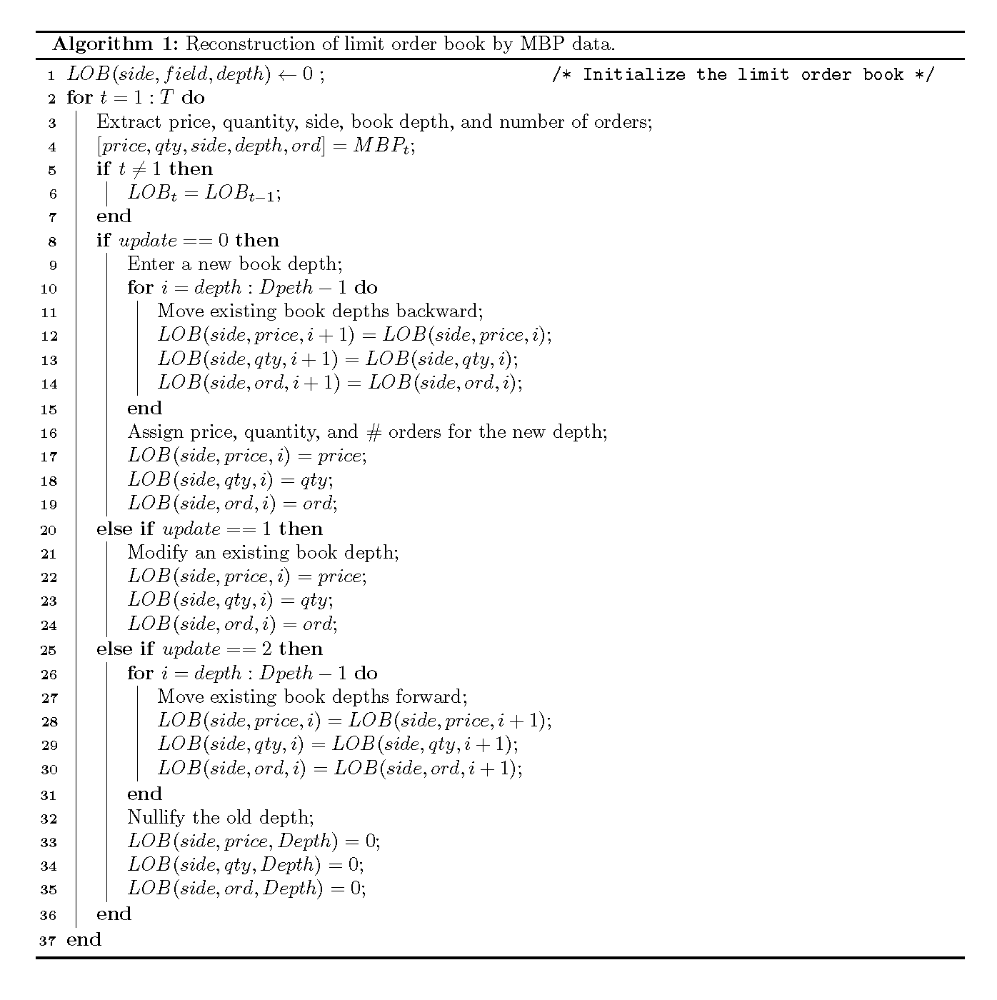
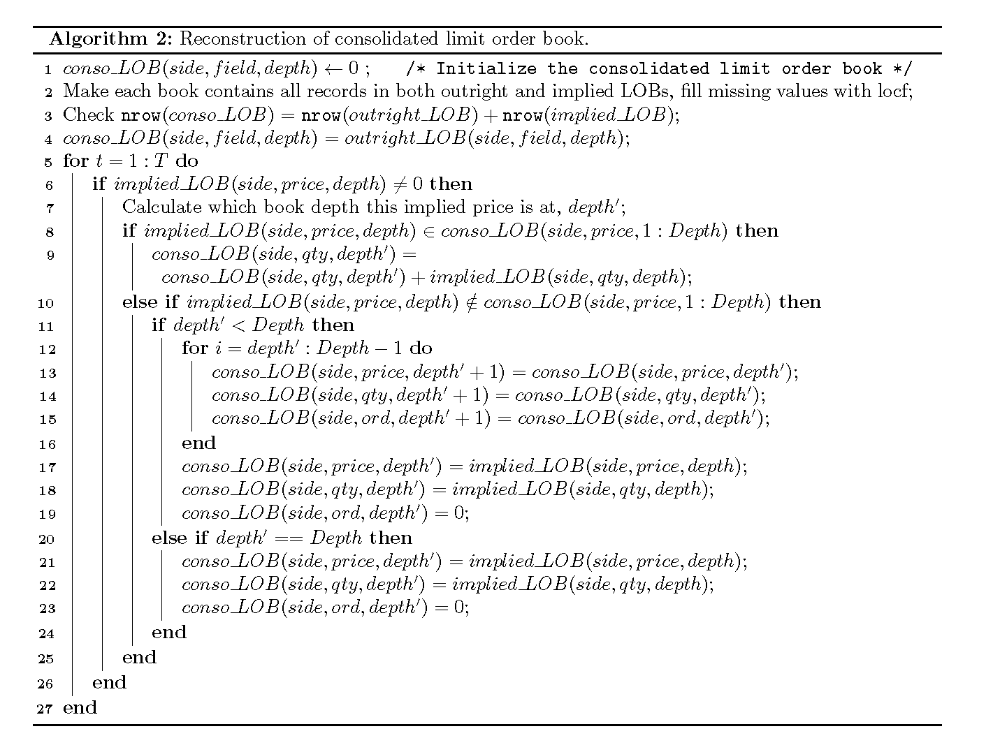
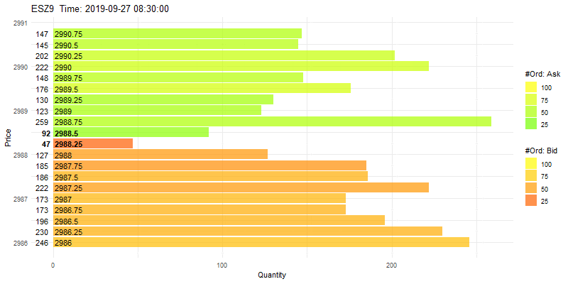

---
output:
  github_document: default
---

<!-- README.md is generated from README.Rmd. Please edit that file -->

```{r, include = FALSE}
knitr::opts_chunk$set(
  collapse = TRUE,
  comment = "#>",
  fig.path = "man/figures/",
  out.width = "100%",
  cache = TRUE
)
```

# cme.mdp: Clean and Analyze Chicago Mercantile Exchange Market Data in R

<!-- badges: start -->

<!-- badges: end -->

Authors: Richie R. Ma and Brian G. Peterson

The goal of `cme.mdp` is to clean Chicago Mercantile Exchange (CME) market data with FIX protocol more easily (pretty user-friendly) in the R environment, including but not limited to trade summaries, quote updates, and limit order book reconstruction.

## Updates

Version 0.1.1 substantially update the `order_book` function and the previous one is deprecated. The
new function does not have any explicit loops, which can improve the speed of processing.

## Introduction

Financial markets have become more transparent and exchanges can provide high-frequency data for traders to better monitor markets, which creates more demand about the high-frequency data usage both in the academia and industry. Most exchanges do not disseminate tabulated complete market data to non-member market participants, and almost all market data are specially coded to enhance the communication efficiency. Thus, financial economists need to know how to clean these untabulated data at first, which is a substantially time-consuming task. This project will closely focus on how to parse and clean the market data of Chicago Mercantile Exchange (CME) under the FIX and MDP protocols and provide other statistical procedures related to market liquidity (in later version).

## CME market data overview

So far, there have been Market by Price (MBP) data which aggregates all individual order information (e.g., size) at every price level, and Market by Order (MBO) data that can show all individual order details (e.g., order priority) at each price level. The MBO data also provide more information about trade summaries than the MBP, so that traders are able to know which limit orders are matched in each trade and their corresponding matching quantities. The detailed trade summaries also assign the trade direction more precisely than the MBP and no quote merge is required for almost all trades. In general, CME will disseminate the MBP incremental updates followed by the order-level details (e.g., submission, cancellation) that describes the reason for MBP updates. Our package considers the above characters and can process both the MBP and MBO data including quote messages and trade summaries.

## Installation

You can install the development version of cme.mdp from [GitHub](https://github.com/) with:

``` r
install.packages("devtools")
devtools::install_github("richie-ma/cme.mdp")
library(cme.mdp)
```

## Trade summary: MBP and MBO

### MBP trade summary

This is a basic example which shows you how to extract trade summary messages from the raw MBP data. CME MBP data disseminate trade summary messages with trade price, trade size, number of orders, and trade aggressor (direction) for most of trades. Trades that are matched with implied orders might not have an explicit aggressor from the CME.

CME does not necessarily display the price as what we see from the Bloomberg Terminal or others and users need to know the display format of the trade price prior to using `trade_summary()` function. Otherwise, a Sunday's input needs to be given to extract this information.

```{r, message=FALSE}
## The sample data is COMEX gold futures on January 2, 2020
## Sample data can be downloaded at CME website
library(cme.mdp)

gold_trades <- trade_summary(
  mbp_input = "R:/xcec_md_gc_fut_20200102-r-00390.gz",
  date = '2020-01-02',
  price_displayformat = 0.1
)

## Showing the trade summary messages of GCF0 contract

head(gold_trades[["GCF0"]])

```

### MBO trade summary with order details

CME MBO data further provide the order details for each trade, including both incoming (market) order and matching (limit) orders. For each trade summary, the first row shows the information of the incoming (market) order and the rest rows show the information of matching (limit) orders.

For each trade, the MBO data assign a unique trade ID and users can know the matched quantity of each matching (limit) order. Generally, the matched quantity of the incoming (market) order equals to the sum of matched quantity of all matching (limit) orders when implied orders are not involved in each trade.

```{r, message=FALSE}
## The sample data is COMEX gold futures on October 25, 2017
## Sample data can be downloaded at CME website
gold_trades_orders <- mbo_match_details(
  mbo_input = "R:/xcec_md_gc_fut.gz",
  price_displayformat = 0.1
)

## Showing the trade summary messages of GCZ7 contract

head(gold_trades_orders[["GCZ7"]])

```

## Quote messages: MBP and MBO

### MBP quote messages

CME MBP quote messages show quote updates at each book depth and all relevant order management is based on the limit order book. The updates include submissions, modifications, and cancellations. CME MBP data disseminate quoted price, quoted quantity, and the number of orders in the queue for each book depth, etc. The MBP quote messages can be used directly to reconstruct the limit order book.

```{r, message=FALSE}

## Example: corn futures on March 12, 2020
## We only use a part of the original data for illustrative purposes

corn_quotes <- quote_message(mbp_input = "R:/xcbt_md_zc_fut_20200312-r-00348",
                             date = '2020-03-12',
                             price_displayformat = 1)

## Showing the trade summary messages of ZCK0 contract

head(corn_quotes[["ZCK0"]])

```

### MBO quote messages with queues

CME MBO data can further provide order queues for each quote message included in the MBP. The MBO data can also show all limit order information, including order ID, order size, and order priority, etc.

```{r, message=FALSE}
## The sample data is COMEX gold futures on October 25, 2017
## Sample data can be downloaded at CME website

sp500_quotes_orders <- mbo_quote_queue(
  mbo_input = "R:/xcme_md_es_fut.gz",
  price_displayformat = 0.01
)

## Showing the trade summary messages of ESZ7 contract

head(sp500_quotes_orders[["ESZ7"]])


```

## Order book

### Reconstruction: Pseudo code

The limit order book reconstruction is based on the quote messages for each single tradeable contract. When the quote update is addition, one needs to move the existing book depths backward and insert information (e.g., price, quantity, number of orders). When the quote update is modification, one just needs to revise the information of that book depth. Finally, when the quote update is cancellation, one needs to move the existing book depths forward and nullify the last depth in the book. Motivated by Christensen and Woodmansey (2013), a pseudocode is shown as follows:



In terms of consolidated limit order book, the function makes each book contains all records in both outright and implied books, fill missing values with last observation carrying forward (locf). Then, the initial consolidated book is set to be the same of the outright limit order book. For each record in the implied book, we compare the prices of each implied book record to those in the consolidated book. When the implied prices are in the existing prices in the consolidated book, we add the implied quantity to the corresponding depth in the consolidated book. Otherwise, the implied prices will be sorted with the existing prices in the consolidated book, with possible book moving if applicable. A pseudocode is shown as follows:



### Feature: Anmiated order book visualization

This package also provides an animated order book application for users and now only supports `book_bar()` function. Users can simply set `animation` to `TRUE` and the function will return the animated order book. Users can also adjust the FPS (frame per second) to control the animation playing speed. One example is given as below.



## Acknowledgements

Ma acknowledges the financial support from the [Bielfeldt Office for Futures and Options Research](https://ofor.illinois.edu/) at the University of Illinois at Urbana-Champaign. Ma also acknowledges prior practice from former OFOR members, including but not limited to Anabelle Couleau and Siyu Bian. Some codes are heavily inspired by their work. The OFOR has signed non-disclosure agreement with the CME and only sample data are used here for illustration purposes.

## Help, Feature Requests and Bug Reports

Please post an issue on the [GitHub repository](https://github.com/richie-ma/cme.mdp/issues).

## References

Christensen, Hugh, R.Woodmansey. “Prediction of Hidden Liquidity in the Limit Order Book of GLOBEX Futures.” Journal of Trading, Summer 2013, pp. 68–95.
